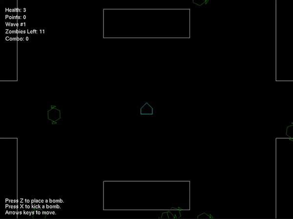

# Ubisoft Next 2023 Programming Submission

The theme for the 2023 competition was to make a game based on Bomberman but with a twist. My submission is titled _Oh No, It Seems Bomberman is Stuck in a Zombie Apocalypse, What a Predicament!_ and is a survival game where Bomberman fights of waves of zombies by kicking bombs at them. It got 3rd place in the competition! The engine features:
- Generic entity component systems
- Event-driven architecture using Signals
- Unit tests
- Bombs, zombies, explosions, and fun!

## Building

Clone the repository and open Game.sln with Visual Studio.

## Resources
I spent January to March learning how to program in C++ and how to design my own ECS. These are some of the resources I learned from.

https://www.learncpp.com/

https://gameprogrammingpatterns.com/

https://github.com/SanderMertens/ecs-faq

https://austinmorlan.com/posts/entity_component_system/

https://www.david-colson.com/2020/02/09/making-a-simple-ecs.html
